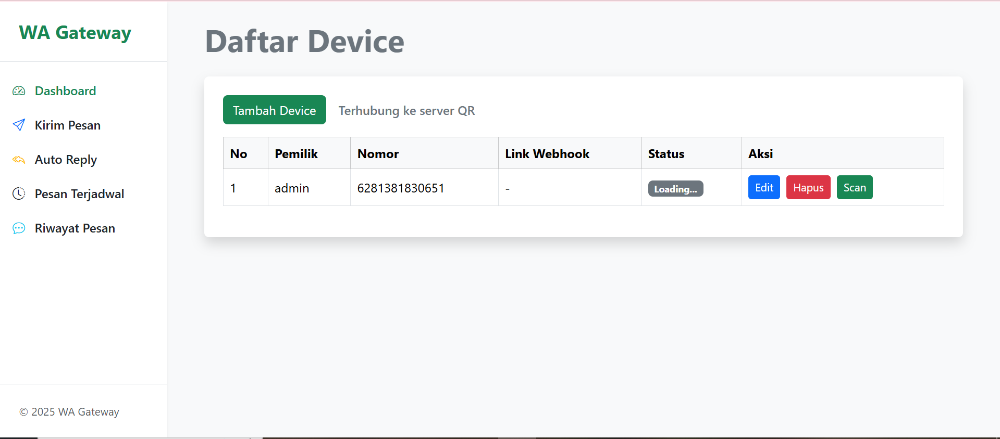
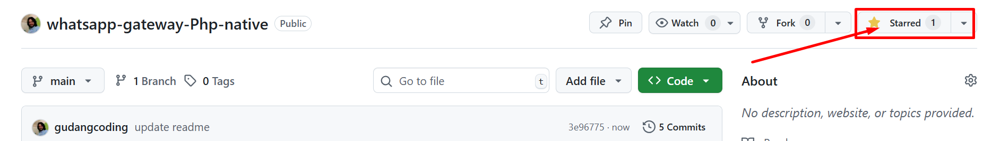

# WA Gateway

WA Gateway adalah aplikasi gateway WhatsApp berbasis Node.js dan PHP yang memungkinkan Anda mengelola device WhatsApp, mengirim pesan, auto-reply, penjadwalan pesan, dan integrasi webhook. Aplikasi ini menyediakan dashboard berbasis web dan API untuk integrasi dengan sistem lain.

## Fitur Utama

- **Manajemen Device WhatsApp**: Tambah, hapus, dan kelola beberapa device WhatsApp.
- **Kirim Pesan**: Kirim pesan WhatsApp ke nomor tujuan melalui dashboard atau API.
- **Auto Reply**: Atur balasan otomatis untuk pesan masuk.
- **Pesan Terjadwal**: Jadwalkan pengiriman pesan ke nomor tertentu.
- **Riwayat Pesan**: Lihat riwayat pesan yang telah dikirim.
- **Integrasi Webhook**: Setiap device dapat dihubungkan ke webhook untuk notifikasi.
- **Dashboard Web**: Antarmuka web berbasis PHP (Bootstrap) untuk kemudahan penggunaan.
- **API & Socket.IO**: Endpoint API dan real-time QR code untuk koneksi WhatsApp.

## Tampilan Dashboard



## Instalasi

1. **Clone repository**
   ```bash
   git clone <repo-url>
   cd wa-gateway
   ```

2. **Install dependensi Node.js**
   ```bash
   npm install
   ```

3. **Konfigurasi Database**
   - Edit file `helper/koneksi.php` dan `helper/db.js` untuk menyesuaikan koneksi database MySQL Anda.

4. **Jalankan Backend Node.js**
   ```bash
   node server.js
   ```
   Server akan berjalan di `http://localhost:3000`.

5. **Akses Dashboard**
   - Buka `index.php` melalui web server (misal: XAMPP, Laragon, dsb).

## Struktur Folder

- `server.js` : Backend utama Node.js (API, Socket.IO, WhatsApp handler)
- `index.php` : Dashboard utama berbasis PHP
- `module/` : Modul fitur dashboard (home, kirim-pesan, auto-reply, pesan-terjadwal, history)
- `helper/` : Helper untuk koneksi database dan utilitas
- `sessions/` : Penyimpanan session WhatsApp per device
- `1.png` : Contoh tampilan dashboard

## API Endpoint

- `POST /api/send-message`  
  Kirim pesan WhatsApp.
  - Body: `{ pengirim, nomor, pesan }`
- `POST /api/reset-session`  
  Reset session device tertentu.
  - Body: `{ nomor }`
- `GET /api/device-status/:nomor`  
  Cek status koneksi device.
- `GET /api/numbers`  
  List device yang terdaftar.

## Catatan Pengembangan

Lihat file `catatan.txt` untuk langkah-langkah setup awal proyek.

## Lisensi
Siapapun bebas menggunakan source code ini secara gratis, **dengan syarat wajib memberikan ⭐ (star) pada repository ini**.  
Jika belum memberikan star, maka dianggap masih berhutang sampai memberikan star.  
Dukung terus pengembangan dengan cara sederhana ini, terima kasih!


ISC © LKP Naura 